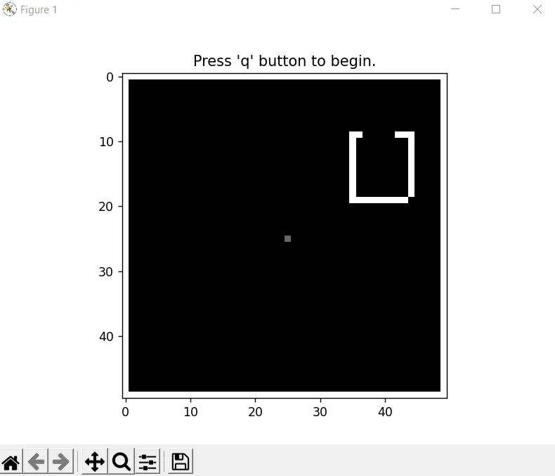

# 🤖 Multi-Bot Exploration using A* Pathfinding

This project implements a simulation of multiple autonomous bots exploring a grid-based environment using **A\* pathfinding**. The bots coordinate to map out all unexplored regions of a 2D map, avoiding walls and marking visited locations.

---

## 📸 Demo

### 🖼️ Image Snapshot




### 🎥 Video Demonstration

[Click here to watch the demo](https://drive.google.com/file/d/1eqjwyNpHIvzfWWvoEQMr_JdchoFdN8dN/view?usp=sharing)


---

## 🧠 Features

- Multiple bots collaboratively explore an unknown grid.
- Real-time visualization using `matplotlib`.
- A* pathfinding algorithm for optimal routing.
- Dynamic detection of unexplored areas.
- Visual feedback on explored, planned, and blocked regions.

---

## 📁 Project Structure

├── multi_robots_exploration.py
├── assets/
│ └── simulation-demo.png # Demo image (optional)
├── README.md


---

## ⚙️ How It Works

- The map is initialized as a 50x50 grid with randomly placed **walls**.
- Each bot starts at the center and looks for the **nearest unexplored location**.
- Bots use **Euclidean distance** to find the closest target.
- An A* algorithm plans the optimal path, ignoring walls initially.
- The map is updated at each step to reflect:
  - 🟥 **Mapped** areas
  - 🟨 **Planned** paths
  - ⬛ **Walls**
  - ⬜ **Unmapped** regions

---

## 🛠️ Installation & Setup

### 1. Clone this repository

```bash
git clone https://github.com/okekefrancis112/machine_learning_research.git
cd multi_robot_explorer
```

### 2. Create a virtual ennironment
pyenv virtualenv 3.10.13 myenv
pyenv activate myenv
pip install requirements.txt

---

### 🚀 Run the Simulation

```bash
python multi_robots_exploration.py
```

### Upon launching:

- A grayscale grid will show the map.

- Red boxes = current bot positions

- Red lines = paths to destinations

- Yellow dots = destinations

- Press q to begin the simulation.

---

### 📈 Output

The number of iterations required to fully explore the map is printed at the end:

```bash
Number of iterations: 1450
```

---

### 🔍 Core Algorithms Used

- A* Search: Efficient graph traversal algorithm for route planning.

- Greedy Nearest Point Selection: Bots select the closest unexplored point based on Euclidean distance.

- Map Updates: Each bot marks its path and destination to prevent overlapping exploration.

---

### 🧪 TODOs & Improvements

- Add inter-bot communication to avoid overlap.

- Implement wall-aware destination planning.

- Add GUI controls for start/pause/reset.

- Extend to 3D grid or dynamic obstacle environments.

---

### 📄 License

This project is licensed under the MIT License.

---

### 🙌 Acknowledgments

Special thanks to all researchers and engineers in the fields of robotics, AI, and autonomous systems whose work inspired this simulation.


---

### ✅ What to Do Next

- Place a snapshot of the simulation in `assets/simulation-demo.png`.
- Upload a screen recording (e.g., `.mp4`) and replace the link in the video section.
- Save your simulation script as `main.py` (or update the filename in the README if it's different).
- Push the project to GitHub or any other version control system.

Let me know if you want a badge section, contributor section, or want this turned into a Jupyter Notebook tutorial.
